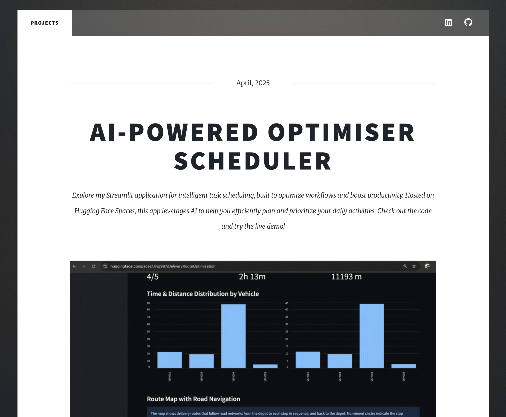

# My Portfolio

This repository contains the source code and assets for my personal portfolio website, built as a GitHub Page to showcase my projects, experience, and skills.

The site is based on the **Massively** template by HTML5 UP, customized to present my work and background.

## Folder Structure

```
/                   # Root directory of the project
├── assets/         # Images, CSS, JavaScript, and other static assets
├── images/         # Portfolio and background images
├── index.html      # Main landing page for the portfolio
├── about.html      # About me section
├── projects.html   # Projects showcase
├── contact.html    # Contact information and form
├── README.txt      # Project documentation (this file)
└── ...             # Other supporting files and configuration
```

## Preview

Below is a preview of my portfolio website:



You can view the [live site here.](https://jhwong19.github.io/jinghui-portfolio/)

## Credits

Credits:
    HTML set up:
        Massively by HTML5 UP

    Demo Images:
        Unsplash (unsplash.com)

    Icons:
        Font Awesome (fontawesome.io)

    Other:
        jQuery (jquery.com)
        Scrollex (github.com/ajlkn/jquery.scrollex)
        Responsive Tools (github.com/ajlkn/responsive-tools)